# PyAgenticRAG - Advanced Multi-Agent Retrieval-Augmented Generation System

[](https://www.python.org/downloads/)
[](https://fastapi.tiangolo.com/)
[](https://python.langchain.com/)
[](https://www.trychroma.com/)

## 🚀 Overview

PyAgenticRAG is a production-ready, enterprise-grade multi-agent system that orchestrates intelligent document retrieval and generation. It combines advanced AI agents, vector databases, and sophisticated reasoning to provide accurate, contextual responses from your organizational knowledge base.

### Key Features

- **🤖 Multi-Agent Architecture**: Sophisticated planning, retrieval, and aggregation agents
- **📚 Multi-Source Data Processing**: PDF, DOCX, TXT, JSON, Web scraping, Database integration
- **🔍 Advanced Vector Search**: ChromaDB integration with semantic similarity search
- **🧠 ReAct Reasoning**: Chain-of-thought planning with action-observation loops
- **📊 Quality Assessment**: Confidence scoring and response quality metrics
- **🌐 Multiple Interfaces**: CLI, Web API, and programmatic access
- **🔧 Production Ready**: Comprehensive logging, error handling, and monitoring
- **📈 Performance Optimized**: Caching, async processing, and scalable architecture

## 🏗️ System Architecture

```mermaid
graph TB
    User[👤 User Query] --> Interface{Interface Type}
    
    Interface -->|CLI Mode| CLI[🖥️ Interactive CLI]
    Interface -->|API Mode| API[🌐 FastAPI Server]
    Interface -->|Single Query| Direct[⚡ Direct Processing]
    
    CLI --> System[🎯 AgenticRAG System]
    API --> System
    Direct --> System
    
    System --> Config[⚙️ Configuration Manager]
    Config --> LLM[🤖 Language Model<br/>Ollama/OpenAI]
    Config --> VectorDB[🔍 Vector Database<br/>ChromaDB/Qdrant]
    
    System --> StateManager[📊 Enhanced State Manager]
    StateManager --> Memory[🧠 Agent Memory]
    StateManager --> ErrorHandler[❌ Error Handler]
    StateManager --> Metrics[📈 Performance Metrics]
    
    System --> DataManager[📁 Data Source Manager]
    DataManager --> FileSource[📄 File Sources<br/>PDF, DOCX, TXT, JSON]
    DataManager --> WebSource[🌐 Web Sources<br/>URL Scraping]
    DataManager --> DBSource[🗄️ Database Sources<br/>SQL Queries]
    DataManager --> APISource[🔗 API Sources<br/>REST Endpoints]
    
    FileSource --> Processing[⚡ Document Processing]
    WebSource --> Processing
    DBSource --> Processing
    APISource --> Processing
    
    Processing --> Chunking[✂️ Text Chunking]
    Processing --> Embedding[🔢 Embedding Generation]
    Chunking --> VectorDB
    Embedding --> VectorDB
    
    System --> AgentOrchestrator[🎭 Agent Orchestrator]
    
    AgentOrchestrator --> PlanningAgent[🎯 Planning Agent]
    PlanningAgent --> ReactReasoning[🤔 ReAct Reasoning]
    ReactReasoning --> ExecutionPlan[📋 Execution Plan]
    
    ExecutionPlan --> RetrievalAgents[🔍 Retrieval Agents]
    RetrievalAgents --> LocalRAG[📚 Local RAG Agent]
    RetrievalAgents --> WebSearch[🌐 Web Search Agent]
    RetrievalAgents --> DatabaseAgent[🗄️ Database Agent]
    
    LocalRAG --> VectorSearch[🔎 Vector Search]
    VectorSearch --> VectorDB
    VectorDB --> SearchResults[📋 Search Results]
    
    SearchResults --> AggregatorAgent[🎯 Aggregator Agent]
    AggregatorAgent --> Synthesis[⚗️ Response Synthesis]
    Synthesis --> QualityAssessment[✅ Quality Assessment]
    QualityAssessment --> FinalResponse[📝 Final Response]
    
    FinalResponse --> ResponseDelivery{Response Delivery}
    ResponseDelivery -->|CLI| CLIOutput[🖥️ CLI Output]
    ResponseDelivery -->|API| JSONResponse[📄 JSON Response]
    ResponseDelivery -->|Direct| PythonObject[🐍 Python Object]
    
    System --> Monitoring[📊 System Monitoring]
    Monitoring --> Logging[📝 Comprehensive Logging]
    Monitoring --> HealthChecks[💚 Health Checks]
    Monitoring --> Analytics[📈 Performance Analytics]
    
    classDef userNode fill:#e1f5fe,stroke:#01579b,stroke-width:2px
    classDef systemNode fill:#f3e5f5,stroke:#4a148c,stroke-width:2px
    classDef agentNode fill:#e8f5e8,stroke:#2e7d32,stroke-width:2px
    classDef dataNode fill:#fff3e0,stroke:#e65100,stroke-width:2px
    classDef outputNode fill:#fce4ec,stroke:#ad1457,stroke-width:2px
    
    class User,Interface,CLI,API,Direct userNode
    class System,AgentOrchestrator,StateManager,Config systemNode
    class PlanningAgent,LocalRAG,WebSearch,DatabaseAgent,AggregatorAgent agentNode
    class DataManager,FileSource,WebSource,DBSource,VectorDB dataNode
    class FinalResponse,CLIOutput,JSONResponse,PythonObject outputNode
```



## 🚀 Quick Start

### Prerequisites

- Python 3.11 or higher
- Git (for cloning)
- Ollama (for local LLM) or OpenAI API key

### Installation

1. **Clone the repository:**
   ```bash
   git clone https://github.com/ShanKonduru/PyAgenticRAG.git
   cd PyAgenticRAG
   ```

2. **Set up virtual environment:**
   ```bash
   python -m venv .venv
   
   # Windows
   .venv\Scripts\activate
   
   # Linux/Mac  
   source .venv/bin/activate
   ```

3. **Install dependencies:**
   ```bash
   pip install -r requirements.txt
   ```

4. **Configure the system:**
   ```bash
   # Copy environment template
   cp .env.example .env
   
   # Edit configuration (optional)
   # The system works out-of-the-box with default settings
   ```

5. **Add your documents:**
   ```bash
   # Create data directory and add your documents
   mkdir -p data
   # Copy your PDF, DOCX, TXT files to ./data/
   ```

## 🎯 Usage

### 1. Interactive CLI Mode

Start an interactive session for exploring your knowledge base:

```bash
python main_enhanced.py --mode cli
```

**Features:**
- Interactive question-answering
- Real-time system status
- Data source management
- Performance metrics

**Example Session:**
```
🚀 PyAgenticRAG - Advanced Agentic RAG System
==================================================

Options:
1. Ask a question
2. View system status  
3. Refresh data sources
4. Exit

Select an option (1-4): 1

Enter your question: What is our data retention policy?

🔍 Processing query: What is our data retention policy?
--------------------------------------------------

📝 Response:
Based on the retrieved information, our data retention policy specifies:
- Customer data: 5 years after last interaction
- Financial records: 7 years
- Employee records: 3 years after termination
- Email communications: 2 years
- System logs: 1 year

📊 Metadata:
   Confidence: 0.95
   Processing time: 12.3s
   Sources used: 3
```

### 2. Web API Server

Launch the FastAPI web server for API access:

```bash
python main_enhanced.py --mode web
```

**API Features:**
- RESTful endpoints with OpenAPI documentation
- Async processing for high concurrency
- Session management and background tasks
- Health checks and system monitoring

**Access Points:**
- **API Documentation**: http://localhost:8000/docs
- **Health Check**: http://localhost:8000/health
- **System Status**: http://localhost:8000/status

**Example API Usage:**
```bash
curl -X POST "http://localhost:8000/query" \
  -H "Content-Type: application/json" \
  -d '{
    "query": "What is our security policy?",
    "user_id": "user123",
    "streaming": false
  }'
```

**Response:**
```json
{
  "session_id": "uuid-here",
  "query": "What is our security policy?",
  "response": "Our security policy includes multi-factor authentication...",
  "confidence_score": 0.92,
  "processing_time": 8.5,
  "sources": [
    {
      "id": "doc_123",
      "source": "security_policy.txt",
      "relevance_score": 0.89
    }
  ],
  "metadata": {
    "total_steps": 3,
    "errors_count": 0,
    "execution_strategy": "sequential_with_parallelism"
  }
}
```

### 3. Single Query Mode

Process individual queries for scripting and automation:

```bash
python main_enhanced.py --mode query --query "What are our backup procedures?"
```

**Output:**
```
🔍 Processing query: What are our backup procedures?

================================================================================
RESPONSE:
================================================================================
Our backup procedures include:
- Critical systems: Continuous backup with 15-minute RPO
- Standard systems: Daily backups at 2 AM local time  
- Archive data: Weekly full backups
- Cloud infrastructure: AWS S3 with cross-region replication
- Recovery testing: Monthly recovery tests on sample data

--------------------------------------------------------------------------------
Confidence: 0.94 | Processing time: 15.2s | Sources: 2
--------------------------------------------------------------------------------
```

### 4. Programmatic Integration

Use PyAgenticRAG in your Python applications:

```python
from src.agentic_rag_system import create_rag_system
from src.enhanced_agent_state import create_initial_state

# Initialize the system
system = create_rag_system()

# Process a query
initial_state = create_initial_state(
    query="What is our data classification policy?",
    user_id="api_user_123"
)

result = system.process_query(initial_state)

# Access results
print("Response:", result["final_response"])
print("Confidence:", result["confidence_score"])
print("Sources:", len(result["retrieved_documents"]))

# Access metadata
print("Processing time:", result["processing_time"])
print("Execution strategy:", result["execution_strategy"])
```

## ⚙️ Configuration

### Configuration Files

The system supports multiple configuration methods:

#### 1. YAML Configuration (`config/config.yaml`)
```yaml
llm:
  provider: "ollama"
  model: "llama3"
  temperature: 0.7
  max_tokens: 2000

vector_db:
  provider: "chroma"
  collection_name: "pyagentic_rag"
  embedding_model: "sentence-transformers/all-MiniLM-L6-v2"

data_sources:
  enabled_sources:
    - "local_files"
    - "web_search"
  local_data_path: "./data"

api:
  host: "localhost"
  port: 8000
  debug: false

logging:
  level: "INFO"
  file_path: "./logs/pyagentic_rag.log"
```

#### 2. Environment Variables (`.env`)
```env
# LLM Configuration
LLM_PROVIDER=ollama
LLM_MODEL=llama3
LLM_TEMPERATURE=0.7

# Vector Database
VECTOR_DB_PROVIDER=chroma
VECTOR_DB_COLLECTION=pyagentic_rag

# API Settings
API_HOST=localhost
API_PORT=8000
API_DEBUG=false

# Data Sources
LOCAL_DATA_PATH=./data
```

#### 3. Command Line Arguments
```bash
# Custom configuration file
python main_enhanced.py --config custom_config.yaml

# Custom data path
python main_enhanced.py --data-path /path/to/documents

# Custom log level  
python main_enhanced.py --log-level DEBUG
```

### Supported Data Sources

| Source Type | Supported Formats | Description |
|-------------|------------------|-------------|
| **Local Files** | PDF, DOCX, TXT, JSON, MD | Documents in local filesystem |
| **Web Sources** | HTML pages, APIs | Web scraping and API data |
| **Databases** | PostgreSQL, MySQL, SQLite | SQL database queries |
| **Cloud Storage** | S3, Azure Blob, GCS | Cloud document repositories |

### LLM Providers

| Provider | Models | Configuration |
|----------|---------|---------------|
| **Ollama** | llama3, mistral, codellama | Local installation required |
| **OpenAI** | gpt-4, gpt-3.5-turbo | API key required |
| **Anthropic** | claude-3 | API key required |
| **Azure OpenAI** | Custom deployments | Endpoint and key required |

### Vector Databases

| Database | Features | Use Case |
|----------|----------|----------|
| **ChromaDB** | Local, persistent, embedded | Development, small-scale |
| **Qdrant** | Cloud, scalable, fast | Production, large-scale |
| **Pinecone** | Managed, serverless | Enterprise, high-availability |

## 🏗️ Architecture Details

### Core Components

#### 1. Enhanced Agent State
- **Memory Management**: Conversation history and context retention
- **Error Tracking**: Comprehensive error handling and recovery
- **Performance Metrics**: Response time and quality tracking
- **Session Management**: Multi-user session support

#### 2. Planning Agent with ReAct Reasoning
- **Query Analysis**: Sophisticated understanding of user intent
- **Strategy Planning**: Multi-step execution planning
- **Agent Selection**: Optimal agent routing based on query type
- **Error Recovery**: Adaptive replanning on failures

#### 3. Retrieval Agents
- **Local RAG Agent**: Vector database search with semantic similarity
- **Web Search Agent**: Real-time web information retrieval
- **Database Agent**: Structured data querying and analysis
- **API Agent**: External service integration

#### 4. Aggregator Agent
- **Multi-Source Synthesis**: Combining information from multiple agents
- **Quality Assessment**: Response confidence and accuracy scoring
- **Source Attribution**: Transparent source citing and metadata
- **Response Optimization**: Enhanced readability and structure

### Data Flow


### Error Handling & Recovery

The system implements comprehensive error handling:

- **Graceful Degradation**: Continues operation with reduced functionality
- **Automatic Retry**: Configurable retry logic with exponential backoff
- **Fallback Strategies**: Alternative execution paths on component failure
- **Error Context**: Detailed error information for debugging
- **Recovery Procedures**: Automatic system recovery and state restoration

### Performance Optimizations

- **Query Caching**: Intelligent caching of search results
- **Async Processing**: Non-blocking operations for high concurrency
- **Connection Pooling**: Efficient database and API connection management
- **Batch Processing**: Optimized document processing and embedding generation
- **Resource Management**: Memory optimization and cleanup procedures

## 📊 Monitoring & Analytics

### System Metrics

The system provides comprehensive monitoring capabilities:

#### Performance Metrics
- **Response Time**: Query processing latency
- **Throughput**: Queries processed per minute
- **Success Rate**: Percentage of successful query completions
- **Resource Usage**: CPU, memory, and disk utilization

#### Quality Metrics
- **Confidence Scores**: Response accuracy assessments
- **Source Utilization**: Document retrieval effectiveness
- **User Satisfaction**: Query resolution quality

#### System Health
- **Component Status**: Individual agent and service health
- **Error Rates**: System error frequency and types
- **Uptime**: System availability and reliability

### Accessing Metrics

#### Web Interface
```bash
# System status endpoint
curl http://localhost:8000/status

# Detailed metrics endpoint  
curl http://localhost:8000/metrics
```

#### CLI Interface
```bash
python main_enhanced.py --mode cli
# Select option 2: View system status
```

#### Programmatic Access
```python
from src.agentic_rag_system import create_rag_system

system = create_rag_system()
metrics = system.get_system_info()

print("Total queries:", metrics["total_queries"])
print("Success rate:", metrics["performance_metrics"]["success_rate"])
print("Average response time:", metrics["performance_metrics"]["average_response_time"])
```

## 🔧 Development & Customization

### Adding Custom Agents

Create custom agents by extending the base agent interface:

```python
from src.enhanced_agent_state import EnhancedAgentState, AgentExecution
from datetime import datetime

class CustomAgent:
    def __init__(self, config):
        self.agent_name = "CustomAgent"
        self.config = config
    
    def run(self, state: EnhancedAgentState) -> Dict[str, Any]:
        execution = AgentExecution(
            agent_name=self.agent_name,
            start_time=datetime.now()
        )
        
        try:
            # Custom agent logic here
            result = self.process_query(state["query"])
            
            execution.complete({"custom_result": result})
            return {"search_results": {"custom": result}}
            
        except Exception as e:
            execution.fail(ErrorInfo(
                error_type="CustomAgentError",
                message=str(e),
                agent=self.agent_name
            ))
            raise
```

### Adding Data Sources

Implement custom data source connectors:

```python
from src.data_sources import DataSource
from src.vector_store import Document

class CustomDataSource(DataSource):
    def __init__(self, config):
        self.config = config
    
    def load_documents(self) -> List[Document]:
        # Implement custom data loading logic
        documents = []
        
        # Example: Load from custom API
        for item in self.fetch_data():
            doc = Document(
                id=item["id"],
                content=item["text"],
                metadata={"source": "custom_api", **item["metadata"]}
            )
            documents.append(doc)
        
        return documents
    
    def get_source_info(self) -> Dict[str, Any]:
        return {
            "type": "custom_api",
            "status": "active",
            "config": self.config
        }
```

### Custom Vector Store Providers

Add support for additional vector databases:

```python
from src.vector_store import VectorStore, Document, SearchResult

class CustomVectorStore(VectorStore):
    def __init__(self, connection_string):
        self.connection_string = connection_string
        # Initialize custom vector store
    
    def add_documents(self, documents: List[Document]) -> None:
        # Implement document storage
        pass
    
    def search(self, query: str, top_k: int = 5) -> List[SearchResult]:
        # Implement similarity search
        pass
    
    def delete_documents(self, document_ids: List[str]) -> None:
        # Implement document deletion
        pass
```

## 🚀 Deployment

### Local Development

```bash
# Development mode with auto-reload
python main_enhanced.py --mode web --log-level DEBUG
```

### Production Deployment

#### Docker Deployment

```dockerfile
FROM python:3.11-slim

WORKDIR /app
COPY requirements.txt .
RUN pip install --no-cache-dir -r requirements.txt

COPY . .

EXPOSE 8000
CMD ["python", "main_enhanced.py", "--mode", "web"]
```

```bash
# Build and run
docker build -t pyagentic-rag .
docker run -p 8000:8000 -v $(pwd)/data:/app/data pyagentic-rag
```

#### Kubernetes Deployment

```yaml
apiVersion: apps/v1
kind: Deployment
metadata:
  name: pyagentic-rag
spec:
  replicas: 3
  selector:
    matchLabels:
      app: pyagentic-rag
  template:
    metadata:
      labels:
        app: pyagentic-rag
    spec:
      containers:
      - name: pyagentic-rag
        image: pyagentic-rag:latest
        ports:
        - containerPort: 8000
        env:
        - name: VECTOR_DB_PROVIDER
          value: "qdrant"
        - name: LOG_LEVEL
          value: "INFO"
        volumeMounts:
        - name: data-volume
          mountPath: /app/data
      volumes:
      - name: data-volume
        persistentVolumeClaim:
          claimName: pyagentic-rag-data
```

#### Cloud Deployment

**AWS Lambda (Serverless)**
```python
# lambda_handler.py
from src.agentic_rag_system import create_rag_system
import json

def lambda_handler(event, context):
    system = create_rag_system()
    query = json.loads(event['body'])['query']
    
    result = system.process_query(create_initial_state(query))
    
    return {
        'statusCode': 200,
        'body': json.dumps({
            'response': result['final_response'],
            'confidence': result['confidence_score']
        })
    }
```

## 🧪 Testing

### Running Tests

```bash
# Run all tests
python -m pytest tests/

# Run with coverage
python -m pytest tests/ --cov=src --cov-report=html

# Run specific test categories
python -m pytest tests/ -m "unit"
python -m pytest tests/ -m "integration"
```

### Test Structure

```
tests/
├── unit/
│   ├── test_agents.py
│   ├── test_vector_store.py
│   └── test_data_sources.py
├── integration/
│   ├── test_end_to_end.py
│   └── test_api.py
└── fixtures/
    ├── sample_documents/
    └── test_config.yaml
```

### Quality Assurance

The system includes comprehensive quality assurance:

- **Unit Tests**: Individual component testing
- **Integration Tests**: End-to-end workflow testing
- **Performance Tests**: Load and stress testing
- **Security Tests**: Input validation and security scanning

## 📚 Legacy Batch Files (Windows)

For Windows users, the original batch files are still available for quick setup:

* `000_init.bat`: Initialize git repository with user configuration
* `001_env.bat`: Create virtual environment named `venv`
* `002_activate.bat`: Activate the virtual environment
* `003_setup.bat`: Install dependencies from `requirements.txt`
* `004_run.bat`: Execute the legacy main script (`main.py`)
* `005_run_test.bat`: Execute pytest test scripts
* `005_run_code_cov.bat`: Execute code coverage tests
* `008_deactivate.bat`: Deactivate the virtual environment

**Note**: For the enhanced system, use `main_enhanced.py` instead of the legacy `main.py`.

## 🤝 Contributing

We welcome contributions to PyAgenticRAG! Please follow these guidelines:

### Development Setup

1. Fork the repository
2. Create a feature branch: `git checkout -b feature/amazing-feature`
3. Install development dependencies: `pip install -r requirements-dev.txt`
4. Make your changes and add tests
5. Run tests: `python -m pytest`
6. Commit changes: `git commit -m 'Add amazing feature'`
7. Push to branch: `git push origin feature/amazing-feature`
8. Open a Pull Request

### Code Standards

- Follow PEP 8 style guidelines
- Add comprehensive docstrings
- Include unit tests for new features
- Update documentation as needed
- Ensure all tests pass

### Areas for Contribution

- **New Agent Types**: Specialized agents for specific domains
- **Data Source Connectors**: Additional data source integrations
- **Vector Store Providers**: Support for more vector databases
- **UI/UX Improvements**: Enhanced web interface and visualizations
- **Performance Optimizations**: Caching, indexing, and speed improvements
- **Documentation**: Tutorials, examples, and guides

## 📄 License

This project is licensed under the MIT License - see the [LICENSE](LICENSE) file for details.

## 🙏 Acknowledgments

- **LangChain**: For the foundational framework and agent abstractions
- **ChromaDB**: For the excellent vector database implementation
- **FastAPI**: For the modern, fast web framework
- **Ollama**: For local LLM deployment and management
- **Sentence Transformers**: For high-quality embedding models

## 📞 Support

For support, questions, or feature requests:

- **Issues**: [GitHub Issues](https://github.com/ShanKonduru/PyAgenticRAG/issues)
- **Discussions**: [GitHub Discussions](https://github.com/ShanKonduru/PyAgenticRAG/discussions)
- **Documentation**: [Enhancement Guide](ENHANCEMENT_GUIDE.md)

---

**PyAgenticRAG** - Transforming organizational knowledge into intelligent, accessible insights through advanced multi-agent AI systems.
